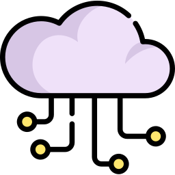
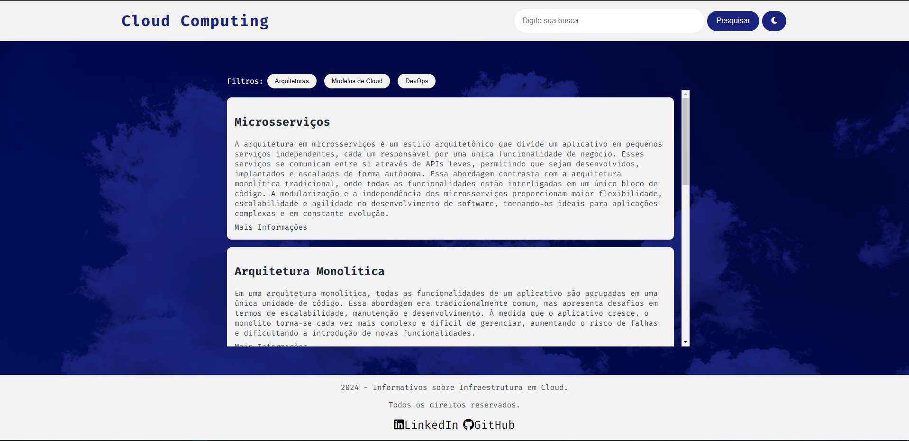
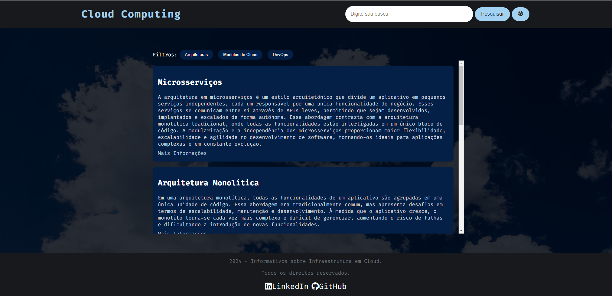
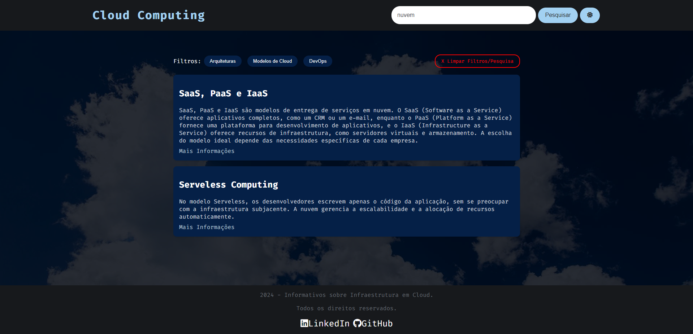

## Cloud Computing - Uma Plataforma de Aprendizado Interativo (Imersão Dev Alura)

  

**Descrição:**

Link para acessar o projeto: [https://imersao-dev.pethersonml.com.br/](https://imersao-dev.pethersonml.com.br/)

Este projeto web tem como objetivo fornecer uma plataforma intuitiva para aprender sobre os conceitos fundamentais do Cloud Computing. Ele oferece uma interface amigável que permite aos usuários pesquisar por tópicos específicos, filtrar o conteúdo por categorias (arquiteturas, modelos de cloud, DevOps) e explorar diversos recursos educacionais.

_Modo Padrão_

_Modo Escuro_

**Funcionalidades:**

- **Pesquisa:** Realize buscas por palavras-chave para encontrar informações relevantes sobre os temas abordados.
- **Filtros:** Utilize os filtros para navegar por categorias específicas, como arquiteturas de software ou modelos de cloud.
- **Conteúdo Rico:** Acesse uma variedade de artigos, tutoriais e links externos para aprofundar seus conhecimentos.
- **Modo Escuro:** Personalize a experiência do usuário com o modo escuro para uma leitura mais confortável em diferentes ambientes.

**Como Usar:**

1. **Navegação:** Utilize a barra de pesquisa para encontrar tópicos específicos ou explore as categorias disponíveis.
2. **Filtros:** Aplique os filtros para refinar os resultados da sua pesquisa.
3. **Exploração:** Clique nos links fornecidos para acessar mais informações sobre cada tópico.
4. **Modo Escuro:** Ative ou desative o modo escuro clicando no ícone do sol/lua no canto superior direito.

**Tecnologias Utilizadas:**

- **HTML:** Estruturação da página.
- **CSS:** Estilização da interface.
- **JavaScript:** Lógica da aplicação, incluindo pesquisa, filtragem e interação com o usuário.

**Futuro**

- Esse projeto ainda pode sofrer alterações para adicionar Responsividade e possivelmente uma integração com APIs para torná-lo mais robusto, possibilitando incluir conteúdo dinamicamente ao acessar a Aplicação ao invés de possuir apenas os conteúdos padrões.

**Contribuições:**

Contribuições são bem-vindas! Se você encontrar algum bug ou tiver sugestões de melhorias, por favor, abra um issue ou faça um pull request.

**Autor:**

- Petherson Monteiro - [LinkedIn](https://www.linkedin.com/in/pethersonmonteiro/) - [GitHub](https://github.com/PethersonML)
